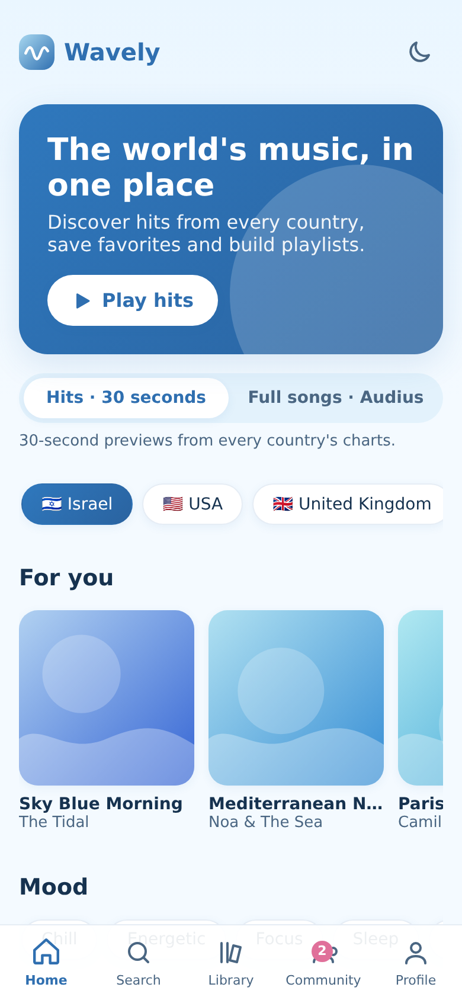
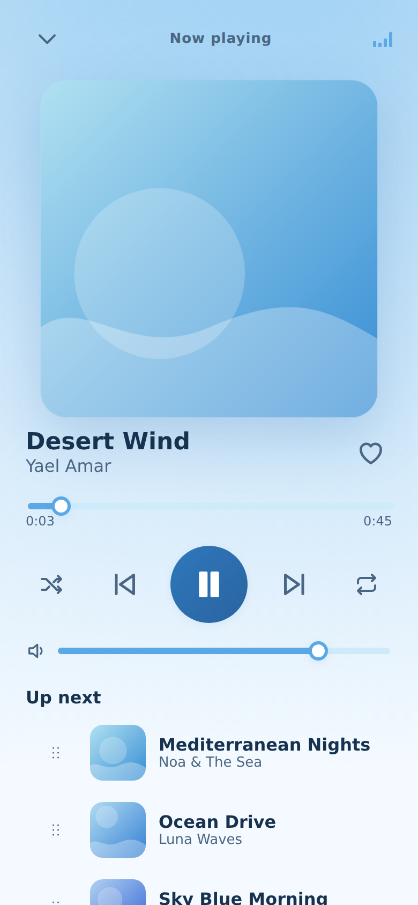
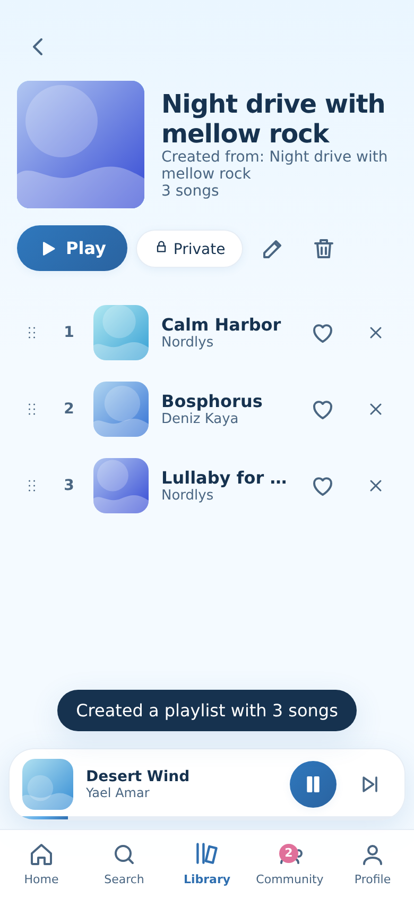
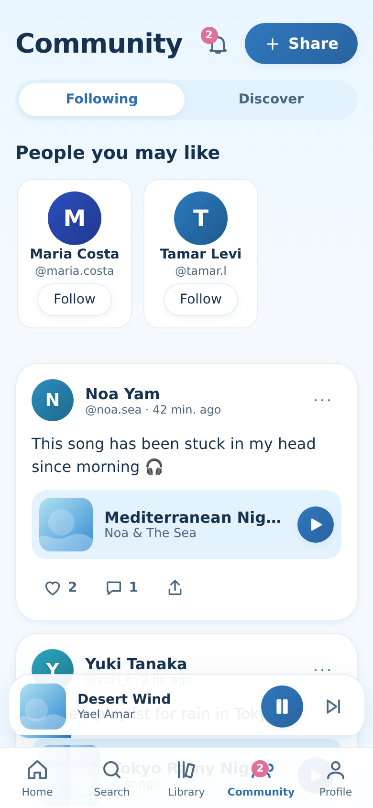
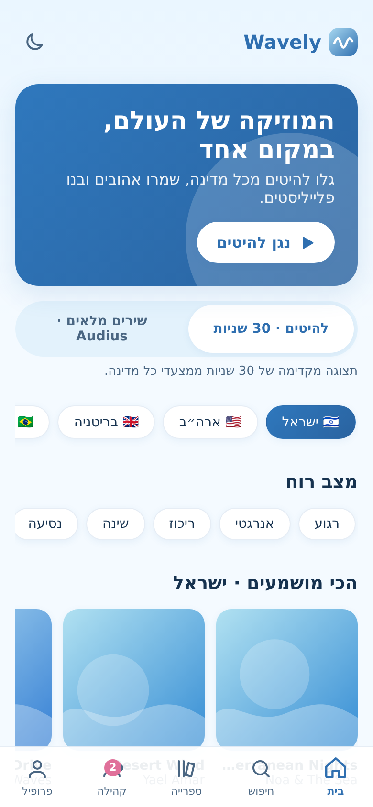
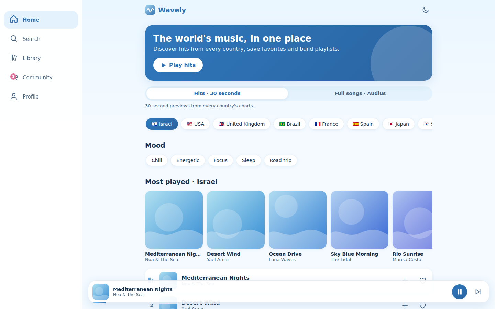

# Wavely 🌊

A music player and social network in soft blue tones. Browse charts from different countries, play songs, build playlists (by hand or from a one-line description), and share them in a community feed. Hebrew (RTL) and English (LTR), installable as a PWA.

> Non-profit showcase project. Not affiliated with Apple or Audius. Previews courtesy of Apple Music, full tracks courtesy of Audius; all rights to the songs belong to their creators.

| Home | Player | Playlist |
|---|---|---|
|  |  |  |

| Community | Hebrew (RTL) | Desktop |
|---|---|---|
|  |  |  |

## Features
- **Player:** queue with drag-to-reorder, shuffle, repeat, seek, volume, buffering state, auto-skip of unplayable tracks, lock-screen controls (Media Session).
- **Music sources** behind one `MusicProvider` interface: Apple charts (30 s previews, per country), Audius (full-length tracks from independent artists), and generated demo songs that play with no network.
- **Playlists:** create, edit, reorder, public/private; "smart create" turns a sentence such as *night drive with mellow rock* into a playlist (rule-based today, the function is isolated so an LLM can replace it).
- **Social:** feed (following / discover), posts of songs and playlists, likes, comments, profiles, follow requests for private profiles, notifications, block and report.
- **Quality:** PWA with offline shell, Hebrew + English, axe-core clean on the main screens in light and dark, keyboard focus handling in dialogs, responsive from phone to desktop.

## Run it
```bash
npm install
npm run dev        # http://localhost:5173
npm run build      # type check + production build
```
No keys are required. Without Supabase variables the app runs fully local (data in `localStorage`).

## Architecture
React + TypeScript + Vite, plain CSS with design tokens (`src/styles/tokens.css`).

```
src/
  services/music/   MusicProvider implementations (itunes, audius, demo + generated audio)
  state/            player (single <audio>), library, social, auth, prefs
  i18n/             Hebrew is the source text; en.ts maps it to English
  components/ pages/
supabase/schema.sql Postgres schema + row level security for the cloud version
docs/ARCHITECTURE.md  details and roadmap
```

### Status of the cloud backend
`supabase/schema.sql` (tables + RLS), email auth and library sync (liked songs, playlists) are written but **not yet verified against a live project**. The community feed currently runs on local seeded data with simulated reactions (`src/services/seed.ts`).

## Deploy
Any static host works. On Vercel: import the repository, framework preset "Vite", no environment variables needed. The link preview image is `public/og.png`.

## Roadmap
Verify and finish the Supabase integration, collaborative playlists, share links, lyrics from a licensed provider, a real LLM for playlist generation.
